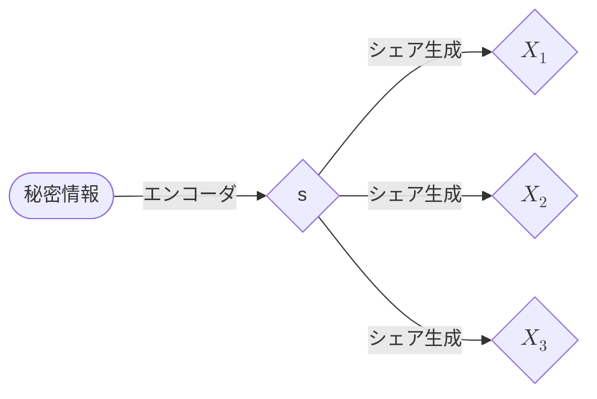

# (n,n)しきい値法
# はじめに
秘密分散法はセキュリティ技術の一つで，情報の秘匿化においてかなり基礎的な理論で構成されています．この分野の研究で情報漏れに対する耐性は，注目されている研究の一つで，暗号系の中で有名な国際会議「CRYPTO」でも毎年この研究に関する論文が発表されています．
私も所属している研究室でこの分野の研究を行っています．これまでの研究成果をなるべく専門用語を用いないように書いていこうと思います．

# 秘密分散法
秘密分散法は秘密情報を分散管理する手法です．このとき分散した後の情報を一般にシェアと呼びます．例えばメッセージを秘密裏に送受信するとき，実際には分散したシェアを送受信することで，送信された情報を見られても，もとのメッセージはわからないということができるようになります．ただし，もちろん受信側ではもとのメッセージが復元できるようにシェアを設定する必要があります．
この過程を簡単に説明します．まず秘密情報を有限体$`\mathbb{F}_{p}`$上の整数に符号化します．ただし$`p`$は素数です．有限体についての詳しい説明は省きますが，体についての詳しい説明は
>ガロア理論12講 概念と直観でとらえる現代数学入門(加藤 文元,2022)

に載っているので興味があれば，調べてみてください．ここでは$`\mathbb{F}_{p}=\lbrace0,1,\ldots,p-1\rbrace`$となっていて，四則演算が$`p`$の剰余演算(モジュロ演算)で定義することで，演算が集合上で閉じているという理解で十分です．ここで符号化された整数値を$`s`$として，また$`s`$を分割する数，つまりシェアの数を$`n`$とします．$`n=3`$のときのシェアの生成過程のイメージはこんな感じです．

# (n,n)しきい値法
秘密分散法の一例に$`(t,n)`$しきい値法というものがあります．この方法ではしきい値$t$個以上のシェアが集まったときに秘密情報が復元できるようにシェアを生成します．このうち最も簡単な例が$`(n,n)`$しきい値法，つまり全てのシェアが集まったときにのみ秘密情報が復元されます．
このときのシェアの生成方法は，シェア$`X_1\text{～}X_{n-1}`$は$`\mathbb{F}_{p}`$上の一様乱数によって生成します．そして最後のシェアは$$X_n=s-\sum_i^{n-1}X_i$$に従って生成します．こうすることで受信側では$`\sum_{i=0}^nX_i`$を計算することで復元することができる．
この手法に対して全てのシェアから1ビットの情報漏れが起こったときに秘密情報に関する情報がどの程度漏れるのかを考えます．
これを計算するコードをPythonで実装するとこのようになります．
このコードの出力は異なる二つの秘密情報間の統計的距離の差です．
