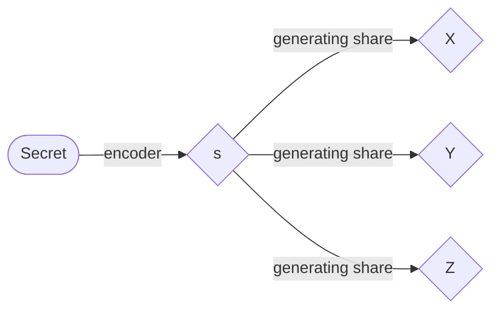

# Leakage Tolerance Calculation Code for (n,n)-Threshold-scheme
## Introduction
The secret sharing scheme is a security technique that consists of a fairly fundamental theory of information secrecy. Resistance to information leakage is one of the most popular research topics in this field, and papers on this research are presented every year at CRYPTO, a well-known international conference in the field of cryptography.
I am also working on this field in my laboratory. I will try to write about the results of my research so far, using as few technical terms as possible.

## The secret sharing scheme
The secret sharing scheme is a scheme for managing secret information in a distributed manner. The information after being distributed is generally called a share. For example, when messages are sent and received in secret, the original message is not known even if the transmitted information is seen by the receiver, because the shares are actually sent and received in a distributed manner. However, it is of course necessary to set up the share so that the original message can be restored at the receiving end.
This process is briefly described below. First, the secret information is encoded as an integer on a finite body $`\mathbb{F}_{p}`$. The first step is to encode the secret information into an integer on a finite body $`\mathbb{F}_{p}`$, where $`p`$ is a prime number. I'll spare you the detailed explanation of finite bodies, but a detailed explanation of bodies is given by
>ガロア理論12講 概念と直観でとらえる現代数学入門(加藤 文元,2022)

So if you are interested, check it out. Here it is $`\mathbb{F}_{p}=\lbrace0,1,\ldots,p-1\rbrace`$, and it is sufficient to understand that the four arithmetic operations are closed on the set by defining them in terms of the remainder operations (modulo operations) of $`p`$. Let $`s`$ be the encoded integer value, and $`n`$ be the number of shares, i.e., the number of partitions of $`s`$. The image of the process of generating shares when $`n=3`$ looks like this.

## (n,n)-Threshold-scheme
One example of a secret sharing scheme is the $`(t,n)`$ threshold scheme. In this scheme, shares are generated so that the secret information can be recovered when a threshold of $`t`$ or more shares are gathered. The simplest example of this is the $`(n,n)`$ threshold scheme, where the secret information is restored only when all the shares are gathered.
In this case, the share $`X_1\text{～}X_{n-1}`$ is generated by a uniform random number over $`\mathbb{F}_{p}`$.
And the final share is generated by

$$X_n=s-\sum_i^{n-1}X_i$$

In this way, the receiver can decode by calculating

$$\sum_{i=0}^nX_i$$

For this scheme, we consider how much information about the secret information is leaked when one bit of information is leaked from all shares.
The following is a Python implementation of the code to calculate this.
The output of this code is the difference in statistical distance between two different secret information.

(Note: I rewrote it in C++ because it was not fast enough in Python. I have put it on Github as well.)

## What does it mean that information leaks occur?
Information leakage here refers to the leakage of one bit from all shares. For example, a situation where 0 is leaked when the share is even and 1 is leaked when the share is odd means that the last bit of the share is leaked. However, there is no intrinsic relationship between the actual value of a share and its leakage value, only the leakage value and the number of share types that leak that value. It is also assumed that the leakage is greatest when the number of share types giving each leakage value is closest to half. This is the theme of my research. Please contact me if you are interested.
